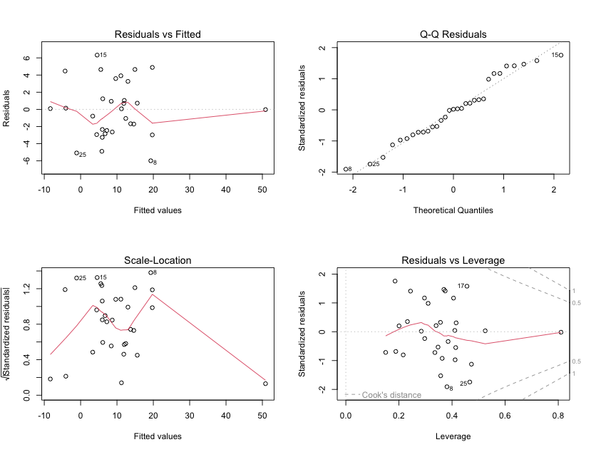

# TP01 OMARJEE Abdoullatif

l'objectif de ce TP est de se familiariser avec les outils de régression linéaire sur R.\
Ce compte rendu a été réalisé de sorte à pouvoir retourner sur les scripts R et de les rééxécuter à souhait , au besoin.\
De ce fait, la démultiplication des scripts R ont été volontairement choisies au profit de la lisibilité du markdown, de sorte à ce que le lecteur puisse se réapproprier le projet sans s'y perdre.\

## Exercice 1

selon les informations prises sur [Kaggle](https://www.kaggle.com/datasets/uciml/pima-indians-diabetes-database) ce database consiste en une étude réalisée sur 768 femmes appartenantes à la communauté des Pima, réalisé par la [NIH](https://www.niddk.nih.gov/) .\
il y a 9 variables différentes décrivant l'état médical des sujets, la variable [pregnant]{.code} indiquant le nombre de grossesses qu'a réalisé chaque sujet et les variables [glucose]{.code},\

### question 1 :

on remarque qu'il y a plusieurs valeurs anormales : par exemple, le [bmi]{.code} ( IMC ) ne peut pas être de 0 comme vu sur [données](données.R) .\
on observe les mêmes problèmes concernant la variable [glucose]{.code} , [diastolic]{.code} , [insulin]{.code} , [triceps]{.code}.\
Pour aller plus loin, on se munit d'un dataframe [pimanull]{.code} dans lequel on a stocké les observations de [pima]{.code} qui posent problème.\
On a ensuite affiché le nombre d'observations de [pima]{.code} et de [pimanull]{.code}.On remarque que les données qui posent problème sont non négligeables au vu des données, et représentent presque la moitié.\
Notre choix a donc été de séparer les données problématiques pour ne conserver que les données cohérentes.\
On a donc corrigé les données, en stockant les résultats dans [pima1]{.code}\

### question 2 :

Notre choix a donc été de séparer les données problématiques pour ne conserver que les données cohérentes.\
On a donc corrigé les données, en stockant les résultats dans [pima1]{.code}\
on se sépare des données problématiques et on les stocke dans l'environnement sous le nom de [pima1]{.code} , on a utilisé la commande [which]{.code} en conséquence.\
en ressortant le résumé du dataframe, on remarque que les variables sont beaucoup plus cohérentes.

### question 3 :

Dans [le script dédié à la pression sanguine](pression_sanguine.R), on utilise la fonction [hist]{.code} pour afficher les données liées à la pression sanguine diastolique , appelée [diastolic]{.code} dans le dataframe [pima1]{.code} que nous utiliserons pour toute la suite de l'étude.\
On a ensuite utilisé la fonction [lines]{.code} sur l'estimateur à noyau de la densité que, lequel on s'en munit grâce à la commande [density]{.code}.\

### question 4 :

Dans [le script lié aux données du diabète](diabète.R) , on a représenté le diabète [diabetes]{.code} en fonction de la pression sanguine [diastolic]{.code} à l'aide de la commande [plot]{.code} .\
On remarque que la pression diastolique reste assez variée entre $60$ et $80$ peu importe le taux de diabète.\
De surcroit, on a représenté les données de diabète [diabetes]{.code} en fonction des résultats du test de diabète [test]{.code} à l'aide de deux boîtes à moustaches [boxplot]{.code} mises côte à côte.Les tests négatifs en rouge clair et les tests positifs en rouge vif.\
On remarque que l'efficacité du test est très limité au vu de la différence faible entre les moyennes ( représentés par la ligne ). et la différence de hauteur des boîtes.\

### question 5 :

Dans [le script dédié à matrice](matrice.R) , on affiche la matrice deux à deux [pairs]{.code} des données de Pima [pima1]{.code} ( on a paramétré un jeu de couleurs à l'aide de la librairie [graphics]{.code} et de la fonction [colors()]{.code}, qui à chaque variable associe une couleur).\
On n'est en mesure de remarquer des informations particulières tant cette matrice deux à deux ne nous offre qu'une vue globale des données.

## Exercice 2

Dans [les données](données.R), on charge les données de l'exercice à l'aide de la commande [read.table]{.code} et en y entrant l'URL des données.\

### question 1

Pour faire la régression , on se place dans [le script lié à la régression](Reg.R) et on utiliser la commande [lm]{.code} pour régresser nos données.Ensuite , on stocke nos résultats dans un objet [regr]{.code} de type [lm]{.code}.\
On affiche les résultats :\

On remarque que le deuxième graphique représente une courbe affine passant par tous les points. On remarque également que le quatrième graphique renvoie une courbe qui ne coupe pas la ligne de Cook. Nous observons que sur les deux graphiques de droite que la courbe n'est pas rectiligne.\
On en déduit que les graphiques nous permettent d'évaluer l'adéquation des résidus à une distribution normale et l'homogénéité de la variance des résidus , et l'influence des observations sur les coefficients.\

Afin d'évaluer la possible colinéarité entre les régresseurs, nous utiliserons la méthode de facteurs d'inflation de variance ( VIF ) à l'aide de la commande [vif]{.code}.\

Les VIF mesurent l'augmentation de la variance des coefficients de régression dus à la corrélation des variables, sur une intervalle de $[1,+\infty[$. Si le vif est proche de$1$, ça indique une faible corrélation entre la variable et les régresseurs.\

Pour s'y faire, on installe la librairie [car]{.code} et on applique [vif]{.code} à [regr]{.code},\
et on l'affiche ( de manière plus esthétique à l'aide de la librairie [knitr]{.code} et [kableExtra]{.code})

On remarque que les régresseurs $Z_4,Z_5,Z_7~\&~Z_9$ ont des VIF élevés, et on en déduit une forte colinéarité avec d'autres régresseurs.\
Et les régresseurs $Z_1,Z_2,Z_3,Z_6,Z_8 et Z_9$ ont des VIF faibles, indiquant une plus faible colinéarité.

### question 2

Dans [ce script](Regwstep.R) , on utilise la commande [step]{.code} sur [regr]{.code} et on stock le résultat dans l'objet [regr2]{.code}.\
On voit une amélioration au niveau de la linéarité de la courbe de la première image quand on fait un [plot]{.code} :\

Les régresseurs $Z_1,Z_2,Z_3,Z_7~\&~Z_8$ ont des VIF proches de $1$ , ce qui indique une colinéarité très faible entre ces variables.